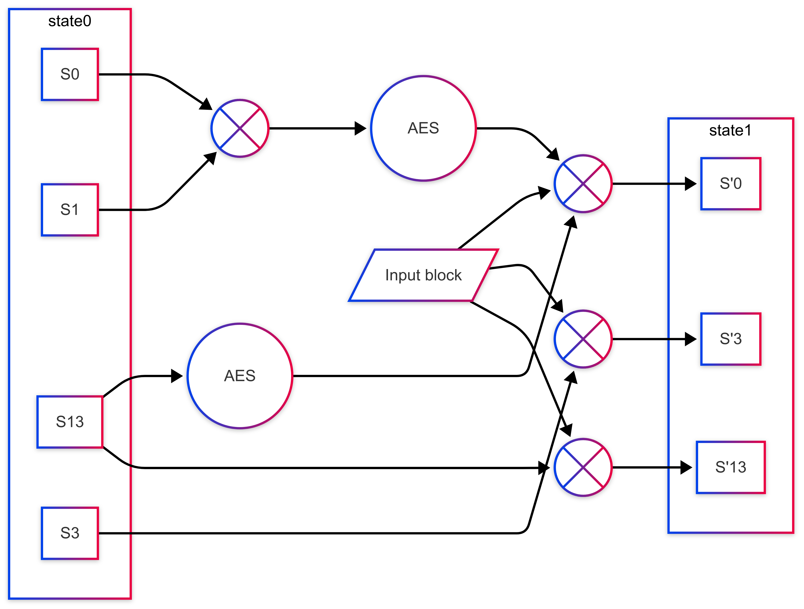
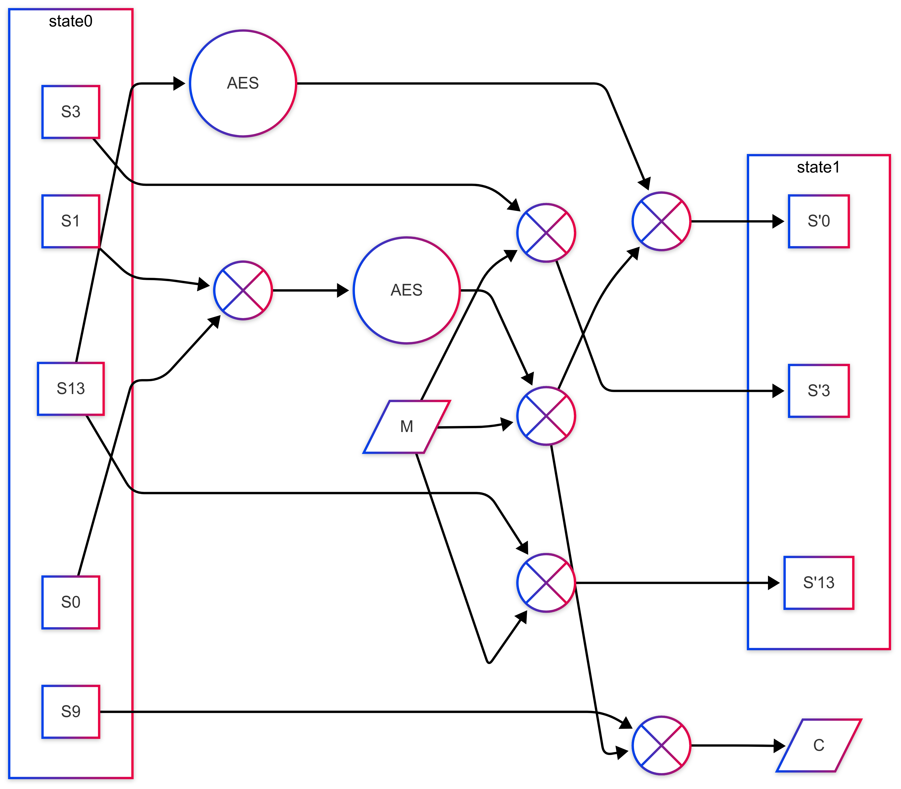
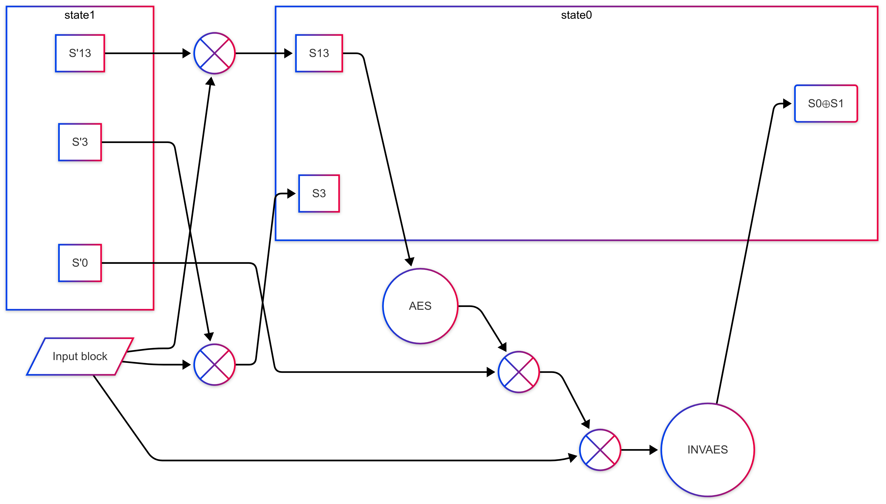

# HiAE: A High-Throughput Authenticated Encryption Algorithm for Cross-Platform Efficiency

A Zig implementation of HiAE, along with support for parallel variants.

## Benchmarks

### Zen4

| Variant | Throughput |
| :------ | ---------: |
| HiAE    | 252.0 Gb/s |
| HiAEX2  | 449.9 Gb/s |
| HiAEX4  | 472.8 Gb/s |

### Apple M1

| Variant | Throughput |
| :------ | ---------: |
| HiAE    | 169.5 Gb/s |
| HiAEX2  | 133.9 Gb/s |
| HiAEX4  |  98.3 Gb/s |

### WebAssembly (lime1+simd128)

| Variant | Throughput |
| :------ | ---------: |
| HiAE    |   9.2 Gb/s |
| HiAEX2  |  11.0 Gb/s |
| HiAEX4  |   7.7 Gb/s |

## Circuits

### Absorption

### Encryption

### Inversion

